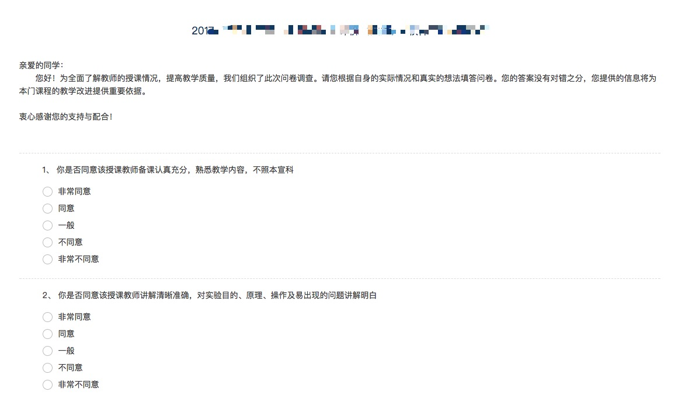

## 某某大学 学评教

> 技术有限, 得每一个粘贴一次

### 用法

1. 复制 `index.js` 中的代码
2. 可以改评价文字(在 js 中)， `commentText` 和 `improvementText`
2. [打开学评教](http://cqupt.mycospxk.com/)（尽量用 chrome 或者 Firefox 等主流浏览器）, 登录你的用户，并点击第一个老师, 如图

    

3. 然后粘贴代码到控制台，按 enter 运行， 控制台打开方法
    - 按 F12
    - 或者右键 -> 审查元素（检查）
4. 点击继续答题重复 **第三步**
